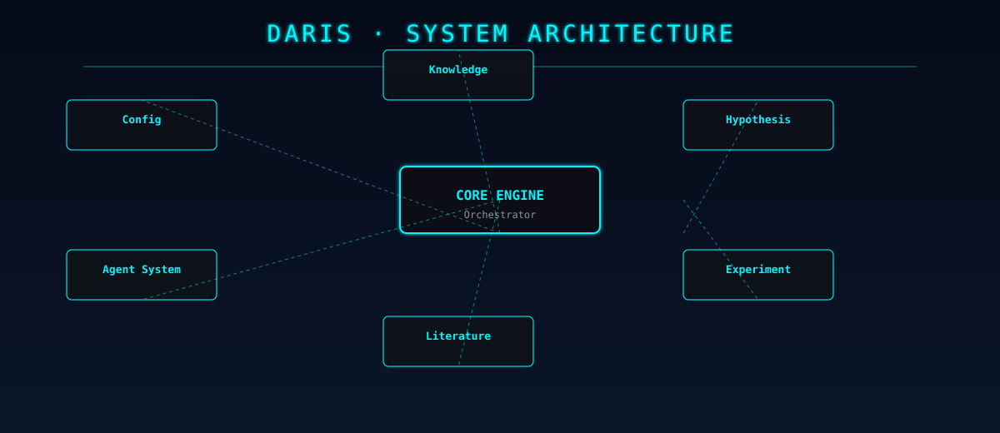

<div align="center">



</div>

# DARIS

*Research workflow orchestration system — from topic to structured output.*

[](https://www.typescriptlang.org/)
[](https://nodejs.org/)
[](LICENSE)
[](https://github.com/disdorqin/DARIS/stargazers)
[](https://github.com/disdorqin/DARIS)

---

DARIS (DAily Research & Intelligent System) orchestrates a configurable multi-agent pipeline that moves from a research topic to a structured literature survey, experiment design, and draft output. It treats the mechanical stages of research — literature retrieval, hypothesis formulation, experiment tracking, and knowledge asset production — as programmable pipeline steps.

It is not a replacement for scientific judgment. It is a scaffold for the repetitive parts: finding papers, tracking experiments, and formatting results.

## Why

Academic research involves well-defined stages that are repeated across every project:

- Literature search and ingestion
- Relevance scoring and summarization
- Hypothesis formulation and experiment design
- Experiment execution and metric tracking
- Drafting slides, reports, and papers

DARIS defines each stage as a configurable pipeline step, with YAML/JSON configuration determining scope and behavior.

## Features

- **Config-Driven Orchestration** — a single config file defines the entire workflow: topic, search sources, experiment parameters, output format
- **Multi-Agent Pipeline** — specialized agents for literature ingestion, hypothesis design, experiment execution, and knowledge export
- **Literature Workflow** — automated ingestion from configured sources with relevance ranking and summarization
- **Experiment Tracking** — benchmark tracking with configurable metrics and baseline comparison
- **Knowledge Asset Export** — auto-generates structured outputs: slides, reports, and draft summaries

## Architecture

<div align="center">
  
</div>

The pipeline is organized into numbered stages in `1_config/` through `8_knowledge_asset/`:

| Module | Directory | Purpose |
|---|---|---|
| Config | `1_config/` | Workflow configuration |
| Agent System | `2_agent_system/` | Multi-agent orchestration |
| Literature | `3_literature_workflow/` | Paper search and ingestion |
| Hypothesis | `4_research_hypothesis/` | Hypothesis design |
| Code Base | `5_code_base/` | Experiment code templates |
| Execution | `6_experiment_execution/` | Benchmark runner |
| Monitor | `7_monitor_system/` | Metrics and logging |
| Knowledge | `8_knowledge_asset/` | Export pipeline |

## Prerequisites

- Node.js 18 or later
- npm or pnpm
- (Optional) Python 3.10+ for experiment execution
- LLM API key (for hypothesis and drafting agents)

## Quick Start

```bash
# Clone and install
git clone https://github.com/disdorqin/DARIS.git
cd DARIS
npm install  # or: pnpm install

# Configure your research workflow
cp 1_config/example.json 1_config/config.json
# Edit config.json with your research topic and parameters

# Run the workflow
npm start
```

## Example Usage

```typescript
// Define a research workflow
const workflow = {
  topic: "retrieval-augmented generation for scientific literature review",
  hypothesis: "RAG improves citation recall over sparse retrieval in domain-specific lit review",
  experiment: {
    method: "RAG with dense retriever",
    baseline: "BM25 sparse retrieval",
    metrics: ["recall@10", "precision@5", "MAP"],
    dataset: "domain_literature_corpus.csv"
  }
}

await daris.run(workflow)
// → Ingests relevant literature
// → Generates experiment design
// → Runs benchmark comparison
// → Exports structured report and slides
```

## Roadmap

- [x] Multi-agent pipeline orchestration
- [x] Literature ingestion and ranking
- [ ] Hypothesis auto-generation with LLM
- [ ] Experiment auto-execution and metric tracking
- [ ] Draft paper and slide generation
- [ ] Plugin architecture for custom literature sources

## Tech Stack

TypeScript · Node.js · Python · OpenClaw · LLM APIs

## Contributing

See [CONTRIBUTING.md](CONTRIBUTING.md). Issues and PRs are welcome.

## License

MIT — see [LICENSE](LICENSE).
